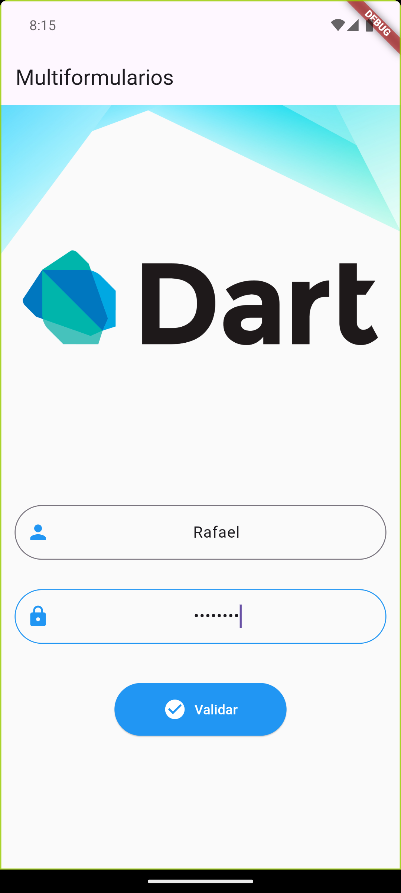
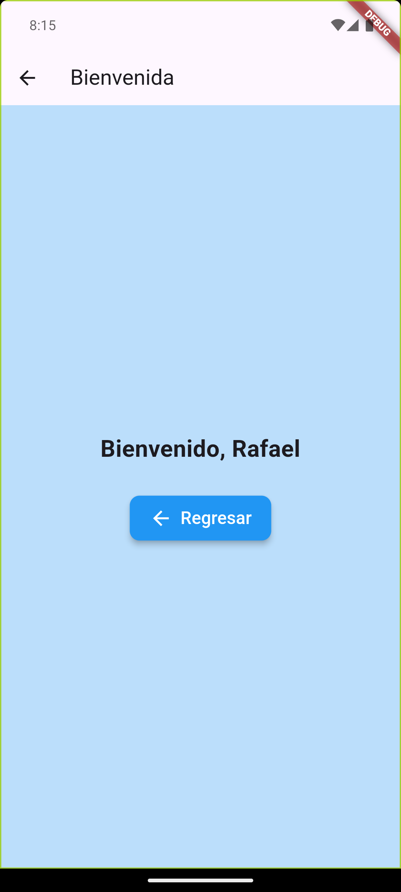
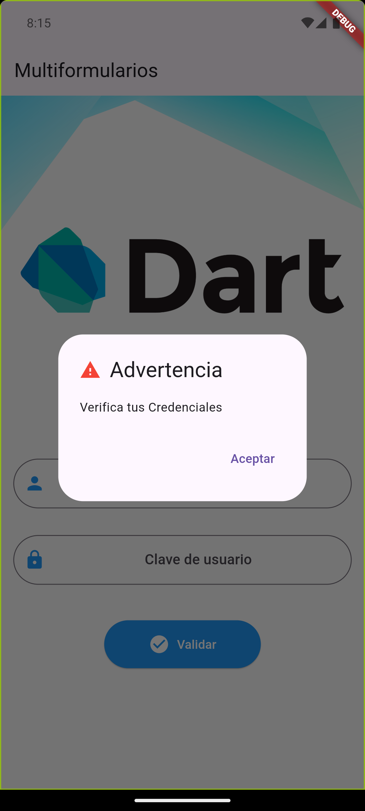

# Flutter Project

This repository contains the source code of my first project in Flutter. This project was developed as part of the Mobile Development.

---

## Personal Information

- **Students:** 
  #### Rafael Zamora Guerrero
  #### Jesús Emilio Manzano Morales
  #### Ana Isabel Sánchez Heredia 

- **Academic Program:** Ingeniería en Computación Inteligente

- **Course:** Programación para dispositivos móviles

- **Professor:** Jesús Alberto Verduzco Ramírez

## Project Description

This Flutter project is a mobile application for managing multiple screens through a Login system.

---

## Project Structure

- **Main Libraries Used:**
  - Flutter (Dart)

## Features

1. **Launch Screen** - Welcome screen of the application.
2. **Activity Screen** - Activity screen, displaying a greeting to the user.
3. **Warning Dialog** - Dialog box showing a warning when credentials are incorrect.

---

## Screenshots

Below are the screenshots of the application in order of appearance:

| Screen | Screenshot |
|----------|-----------|
| Launch Screen |  |
| Main Screen   |  |
| Activity Screen |  |
| Warning Screen  |  |
